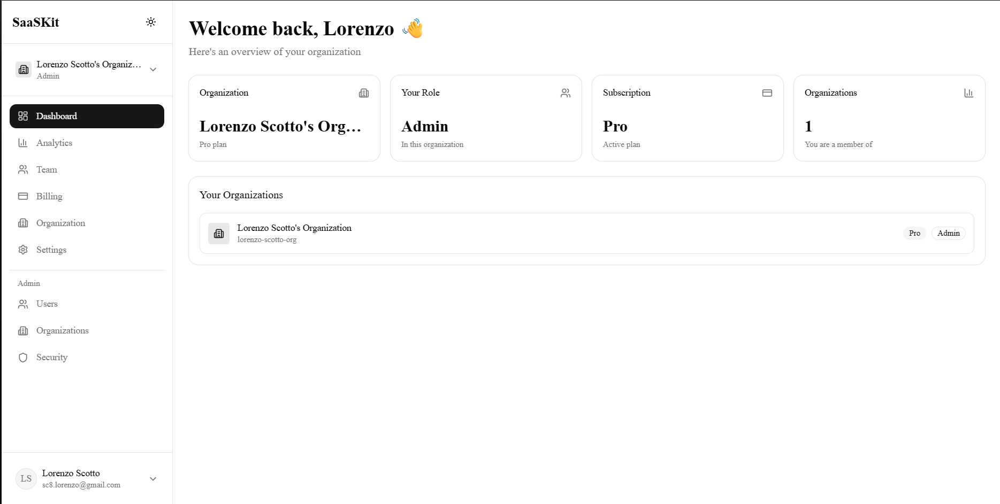
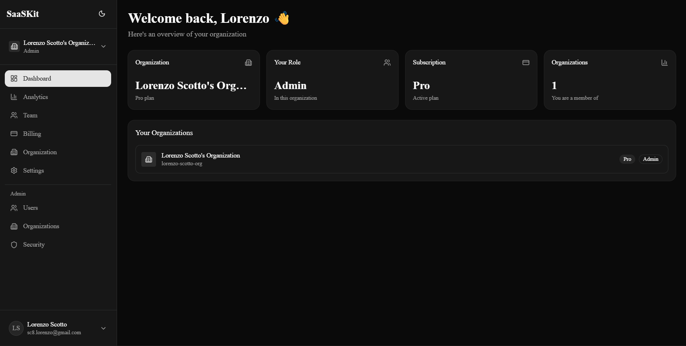

# SaaSKit — Next.js B2B SaaS Starter Kit

> The premium Next.js starter kit for building B2B SaaS products. Ship in hours, not months.

## Live Demo

https://nextjs-b2b-saas-starter.vercel.app

## Screenshots

### Login

### Dashboard

### Billing

### Team Management

## Features

- Multi-tenancy — Separate organizations with isolated data
- RBAC — Admin, Member and Viewer roles with granular permissions
- Complete Auth — Email, Google OAuth and Magic Link
- Stripe Subscriptions — Checkout, portal and webhooks ready
- Transactional Emails — Team invites and notifications with Resend
- Team Management — Invite members, change roles, remove users
- Admin Dashboard — Manage all users and organizations
- Dark Mode — Light, dark and system mode
- Deploy Ready — Configured for Vercel

## Tech Stack

- Next.js 16
- TypeScript
- Tailwind CSS v4
- Supabase (Database + Auth)
- Stripe (Payments)
- Resend (Emails)
- shadcn/ui (UI Components)
- Zod + React Hook Form

## Get Started

Buy on Gumroad to get the full source code.
